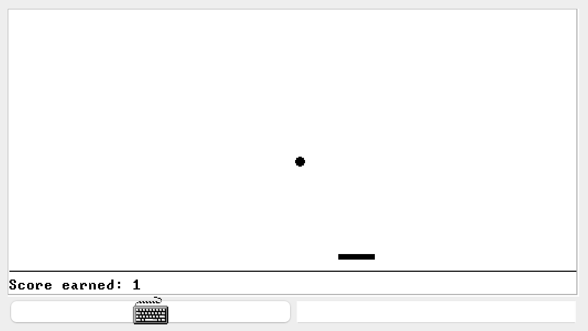

# README

### Improtant!

I implement Pong game. I did not notice that Pong is not an option for this project until the end of class at 03/02, which is almost the DDL for this project and there is no more time to write a new one. I do not want to refer to solutions of others due to academic integrity, so I just use my Pong game as my submission for this project. 

As for the implementation of my Pong game, I claim that I **absolutely** **did not refer to any code** neither from the available example of the course nor from any other sources. All of the codes were implemented by myself. Please check my code. Thank you!

### How to use

```
JackCompiler.sh <abosulute path to the directory containing the .jack files>
```

The generated `.vm` files are in the same directory as the `.jack` files.

Then load the directory using `VMEmulator.sh`.

### About the game

Running snapshot.



- Moving horizontally the paddle using $\leftarrow$ or $\rightarrow$. 

- Every time the ball is successfully bounced, the score will increment by 1.

- If the ball fails to be bounced when it reaches the same height as the paddle, the game will end.

- Press ESC to quit.

### Implementation

The whole game is implemented as four classes

```
- Main.jack
- Game.jack
- Paddle.jack
- Ball.jack
```

The `Main` class just initialize a new game and start it.

The `Game` class wraps the `Paddle` and `Ball` classes and initializes their objects as parts of the game. In `Game.playGame()`, it runs a forever loop until the game ends, where the program checks the status of the ball, detects any input from keyboard, update the location of ball and paddle on the screen and outputs the score and splitting line.

The `Paddle` class describes a paddle for the game.

The `Ball` class describes a ball for the game. Besides the basic functions, it also checks the failure of the ball by comparing it's coordinates with the paddle's and makes potential changes to the direction of the ball by checking its location.

Please also refer to the **comments** in the code for more details.

